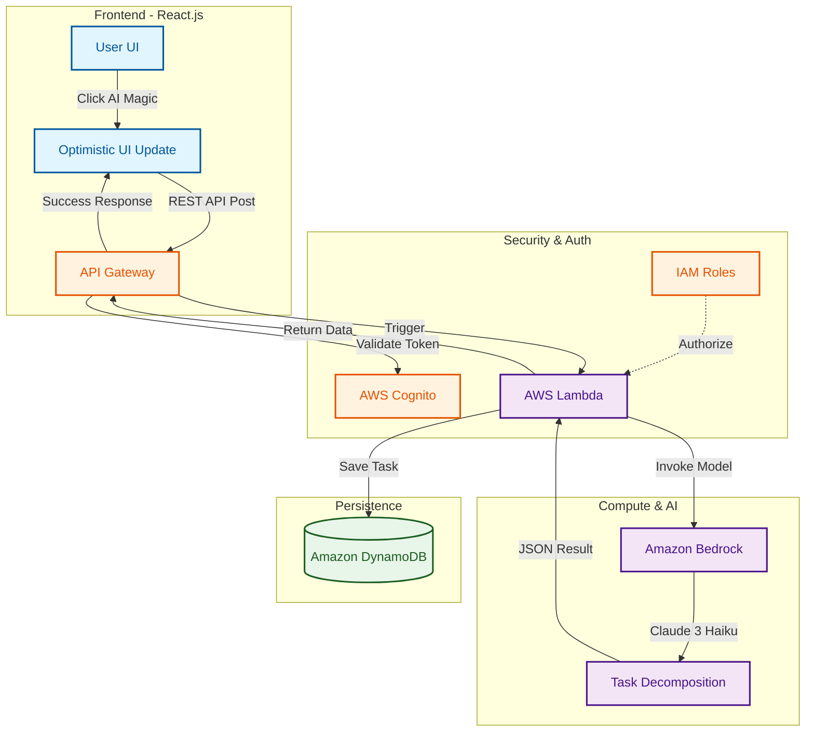

# AI-Powered Serverless Task Orchestrator 🪄

A sophisticated, cloud-native project management tool built with the **MERN** stack and **AWS Serverless** architecture. This application features an "AI Magic" engine that leverages **Generative AI** to transform high-level goals into structured, actionable sub-tasks.

---

## 🧠 Technical Architecture & System Design

### Infrastructure Overview

sequenceDiagram
    participant U as User (UI)
    participant L as Lambda (Node.js)
    participant B as Bedrock (Claude 3)
    participant D as DynamoDB

    U->>L: POST /decompose (Task Data)
    L->>B: InvokeModel (Claude 3 Haiku)
    B-->>L: AI Breakdown JSON
    L->>D: Update Task Record
    L-->>U: 200 OK (Display Sub-tasks)
